Модуль персональных данных
==========================

Модуль персональных данных (Demoxy), представляет собой программное обеспечение,
задачей которого является ограничение зоны хранения и обработки персональных данных
в пределах установленной контролируемой зоны (КЗ).
Demoxy способен осуществлять двунаправленную передачу данных:

- направление передачи **из** КЗ требует извлечение ПДн из входного потока,
  их размещения в собственной базе персональных данных и дальнейшей передачи
  деперсонифицированного потока следующему приемнику

- направление передачи **в** КЗ требует возможного изменения входного потока,
  путем размещения в нем персональных данных хранимых в собственной базе, и его
  передачи следующему приемнику

Для доступа к выполнению операций с персональными данными пациентов, полисами и пр.
необходимо предварительно установить и настроить Demoxy в пределах КЗ.

Установка Demoxy включает в себя выполнение следующих шагов:

1. Определить разрядность операционной системы, на которой будет
   установлен Demoxy
2. На основании сведений шага 1, скачать и установить комплект
   необходимого программного обеспечения
3. Получить дистрибутив Demoxy и выполнить его установку

Количество шагов и их последовательность не зависят от операционной
системы, на которую выполняется установка, отличается лишь способ их
выполнения.

Определение разрядности операционной системы
--------------------------------------------

Все операционные системы можно разделить на два основных типа: 32х- и
64х-разрядные. Знать разрядность системы крайне важно при выборе и установке
программного обеспечения, так как, например, программы, созданные для
работы в 64х-разрядных операционных системах не могут работать на
32х-разрядных. В связи с тем, что Demoxy для нормальной своей работы
требует установки дополнительного программного обеспечения, первым шагом
необходимо узнать разрядность операционной системы, и использовать ее на
шаге 2. во время выбора программного обеспечения.

Windows

`Методика определения разрядности
Windows <http://support.microsoft.com/kb/827218/ru>`__

Определение разрядности Windows можно доверить непосредственно сервису

.. figure:: _static/ii_1.png
   :alt:

или сделать вручную, следуя инструкциям для вашей версии Windows

.. figure:: _static/ii_2.png
   :alt:

Установка комплекта программного обеспечения
--------------------------------------------

Для корректной работы Demoxy требуется провести установку и настройку
базового комплекта программного обеспечения, в который входят:

-  ``MongoDB ( >= 2.6.x)``
-  ``Nodejs ( >= 0.10.x)``
-  ``Elasticsearch ( >= 1.3.x)``

Установка MongoDB
'''''''''''''''''

MongoDB является СУБД, используемой Demoxy для хранения персональных данных
(ПДн), и для его нормальной работы требуется установка MongoDB версии не
ниже 2.6.x. Ниже приводится описание установки MongoDB под конкретные
операционные системы:

Windows

1. Скачиваем дистрибутив MongoDB, соответствующий разрядности вашей
   операционной системы (полученной на шаге 1.):

-  `32x разрядная
   Windows <https://fastdl.mongodb.org/win32/mongodb-win32-i386-2.6.1.msi>`__
-  `64x разрядная
   Windows <https://fastdl.mongodb.org/win32/mongodb-win32-x86_64-2008plus-2.6.1.msi>`__

Далее необходимо определиться с каталогом, в котором будет располагаться
база ПДн. Далее мы предполагаем что каталогом хранения базы ПДн -
``c:\PDn``. Вне зависимости от каталогов установки MongoDB и хранения
базы ПДн, необходимо удостовериться, что вы имеете полный к ним доступ.

1. Запускаем скачанную программу установки и выполняем следующие шаги.
2. Нажимаем ``Next`` |image0|
3. Принимаем лицензионное соглашение и нажимаем ``Next`` |image1|
4. Далее выбираем ``Typical`` и нажимаем ``Install`` |image2| |image3|
5. Далее завершаем установку. По умолчанию MongoDB установится в каталог
   ``c:\Program Files\MongoDB 2.6 Standard``. (Скриншоты показаны для
   Windows 8 x64, но для других версий Windows всё происходит
   аналогично.)
6. В случае, если данного пути не существует, создаем каталог ``c:\PDn``

Установка node.js
'''''''''''''''''

Nodejs — программная платформа, которая является
основой для Demoxy и должна быть установлена перед его запуском.
Необходимую версию данного продукта можно скачать с сайта разработчика.
(**Важно: версия node.js должна быть не ниже 0.10.28 но не 0.11.Х**)
Ниже приводится процесс установки Nodejs под конкретные операционные
системы:

Windows

1. Скачиваем дистрибутив node.js, соответствующий разрядности вашей
   операционной системы:
   
   `Страница загрузки <https://nodejs.org/en/>`__

2. Далее запускаем скачанную программу установки и выполняем следующие
   шаги (опустим разъяснения для некоторых, уже очевидных, этапов):
3. Начало установки.\ |image4| |image5| |image6|
4. Далее убедимся, что каталог для установки выставлен по умолчанию так
   же, и нажимаем ``Next``. |image7|
5. Если на данном этапе какие-то компоненты отключены - включаем их в
   пакет. |image8|
6. Далее нажимаем ``Next``, ``Install`` и завершаем установку.

Установка elasticsearch.
''''''''''''''''''''''''

Elasticsearch — высокоуровневый поисковой сервер, необходимый для запуска
и возможности поиска данных через Demoxy.
Последнюю версию данного продукта можно скачать с сайта разработчика.
Ниже приводится процесс установки Elasticsearch под конкретные операционные
системы:

Windows

1. Скачиваем пакет `elasticsearch <https://download.elastic.co/elasticsearch/elasticsearch/elasticsearch-1.5.2.zip>`__.
2. Далее следует распаковать архив (название должно быть ``elasticsearsh-<версия>``),
   будем считать далее что архив распакован в ``c:\elasticsearsh-1.5.2``.

Установка Redis.
''''''''''''''''

`Redis <http://redis.io/>`__ — сетевое журналируемое хранилище данных
типа "ключ-значение", необходимое для запуска и функционирования Demoxy.
Redis официально не поддерживает ОС Windows но существуют
полностью функциональные сборки для этой операционной системы.
Ниже приводится процесс установки Redis под Windows.

**32x разрядная Windows.**

Чтобы установить Redis для 32х разрядной версии OC Windows воспользуемся
менеджером пакетов `NuGet <http://docs.nuget.org/docs/start-here/overview>`__.

1. `Скачиваем утилиту <http://nuget.org/nuget.exe>`__ менеджера пакетов NuGet для
   командной строки. Будем предполагать далее, что путь до
   утилиты следующий: ``c:\nuget.exe``
2. Выполняем команду:

   ``nuget.exe install Redis-32``

3. Если установка выполнена успешно, то в командной строке будут следующие сообщения:

   ::

       Installing 'Redis-32 <версия redis>'
       Successfully installed 'Redis-32 <версия redis>'

   , где ``<версия redis>`` - последняя версия сборки Redis для 32х разрядной
   Windows, к которой имеет доступ менеджер пакетов.

4. После (3) будет создан каталог ``c:\Redis-32.<версия redis>``. Необходимый
   пакет программ Redis, в этом случае, находится в каталоге:

   ``c:\Redis-32.<версия redis>\tools``

**64x разрядная Windows.**

1. Скачиваем сборку `redis <https://raw.github.com/mythz/redis-windows/master/downloads/redis64-latest.zip>`__
   для Windows x64.
2. Далее следует распаковать архив, будем считать далее что архив распакован в ``c:\redis``.

Получение дистрибутива Demoxy, и выполнение его установки
---------------------------------------------------------

Windows

Скачиваем готовую к использованию версию:

1. Скачать архив с готовой для использования версией можно
   `по этой ссылке <https://s3-eu-west-1.amazonaws.com/tn-releases/dmx/1.0.18-78f738c.zip>`__.
2. Создать каталог, в который будет установлен Demoxy (мы предполагаем,
   что используется каталог ``c:\demoxy``)
3. Извлечь содержимое скачанного архива в каталог установки Demoxy
4. Запустить командную строку Windows, перейти в каталог установки
   (``c:\demoxy``), и выполнить команду ``npm install``. В ходе
   установки возможны следующие сообщения:
   |image9|\ |image10|\ |image11| В случае длительной установки и
   периодической остановки лога сообщений, следует проверить встречаются
   ли в сообщениях идентичные, например: |image12| если да, то проверьте
   ваше интернет соединение и повторите пункт 4 шага 3 заново.(**Важно:
   в некоторых версиях могут не выводиться сообщения,
   начинающиеся с ``npm http get``, это не является ошибкой.**)

На этом процесс установки Demoxy заверешен, можно переходить к его
настройке и запуску.

Запуск elasticsearch и Redis
----------------------------

Запуск elasticsearch
''''''''''''''''''''

1. Перед запуском убедитесь, что в системе установлен пакет
   `JDK <https://ru.wikipedia.org/wiki/Java_Development_Kit>`__.
   При его отсутствии, необходимо предварительно выполнить его установку.
   С инструкциями по установке можно ознакомится, например,
   `на данной странице <http://java-course.ru/begin/install-jdk/>`__.
2. Запускаем командную строку Windows и переходим в каталог ``\bin``, в
   котором расположены исполняемые файлы elasticsearch (в нашем случае
   выполняем команду ``cd "c:\elasticsearsh-1.5.2\bin"``)
3. Выполняем ``elasticsearch.bat``. Должны получить вывод следующего
   формата:

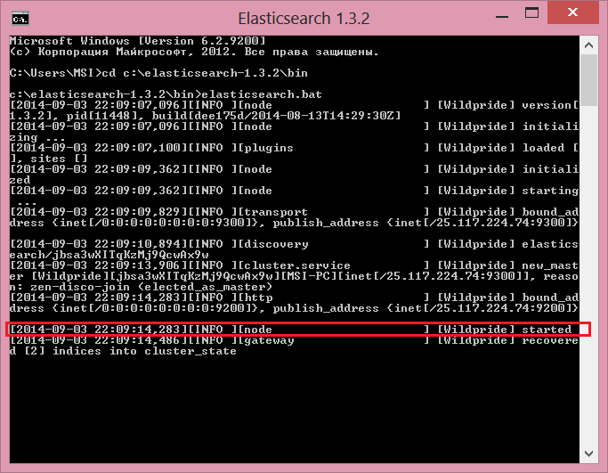

Перед переходом к следующему шагу удостовертесь, что последняя строка вывода
elasticsearch по формату и сообщению совпадает с выделенной. (**Важно:
необходимо обладать правами чтения и записи в папке, в которой
находится пакет elasticsearch**)

**Важно: не закрывайте это окно при работе с Demoxy. В нем запущен поисковой
сервер elasticsearch, и его остановка приведет к ошибке Demoxy.**

Запуск Redis
''''''''''''

1. Переходим в каталог в который был распакован пакет программ Redis.
2. Запускаем ``redis-server.exe``. Должно открыться окно командной
   строки Windows:

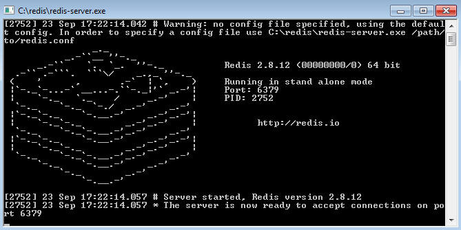

При запуске, возможно, появится оповещение системы безопасности о
блокировке доступа Redis к сетевым ресурсам. Нажмите ``Отмена``, т.к. Redis
и Demoxy будут взаимодействовать только локально.

**Важно: не закрывайте это окно при работе с Demoxy. В нем запущен основной
сервис redis, и его остановка приведет к ошибке Demoxy.**

Запуск MongoDB
--------------

1. Запускаем командную строку Windows, и переходим в каталог ``\bin``, в
   котором расположены исполняемые файлы MongoDB (в нашем случае
   выполняем команду ``cd "c:\Program Files\MongoDB 2.6 Standard\bin"``)
2. Выполняем команду:

   ::

       mongod --journal --dbpath c:\PDn

   MongoDB создаст файл базы ПДн (если он отсутствовал) и разместит ее в
   каталоге ``c:\PDn``, после чего перейдет в режим ожидания подключений
   по порту 27017; в нашем случае подключаться к MongoDB будет Demoxy.
   Во время запуска, MongoDB выводит ряд диагностических и
   информационных сообщений, например:

.. figure:: _static/ii_12.png
   :alt:

Важно удостовериться в том, что в процессе запуска MongoDB не возникло
ошибок, для этого достаточно проверить последние сообщения, если они
совпадают с сообщениями, показанными выше (за исключением даты и
времени), то это означает, что запуск прошел успешно. **Важно: не
закрывайте данное окно после запуска! MongoDB будет продолжать работать
до тех пор, пока открыто данное окно.**

В случае ошибки, последнее сообщение будет содержать текст:

::

    <Дата и время> dbexit: really exiting now

Наиболее частыми проблемами, которые могут возникать при запуске
являются:

-  MongoDB пытается открыть порт, занятый другой программой. В этом
   случае можно указать номер порта, который будет использовать MongoDB
   для подключений через ключ ``--port <номер порта>``. Например, для
   того чтобы запустить MongoDB на порту 13287, нужно выполнить команду:

   ::

       mongod --journal --dbpath c:\PDn --port 13287

-  MongoDB пытается создать/открыть файл базы ПДн в каталоге с
   ограниченным набором прав (существует запрет на создание файлов). Это
   частая ситуация в Windows Server, и в этом случае необходимо
   удостовериться в том, что пользователь, от имени которого запускается
   MongoDB, имеет права на создание файлов.

Параметры запуска Demoxy
------------------------

Для запуска Demoxy переходим в каталог ``c:\demoxy``. Далее перед
запуском следует определиться с параметрами запуска Demoxy. В каталоге
должен быть файл ``run.bat``, в нем должно быть записано следующее

::

    node --max-stack-size=32000 web.js -p 5000 --gui

Далее, чтобы определить параметры запуска можно добавить к этой строке
следующее:

-  ``-i [xxxx-xxxx]`` или ``--id [xxxx-xxxx]`` - параметр,
   определяющий идентификатор Demoxy, где ``[xxxx-xxxx]`` следует заменить
   на выданный вам 8ми значный номер. Если такового нет, то идентификатор
   будет сгенерирован случайным образом.
-  ``-s [num]`` или ``--ps [num]``
   - параметр определяющий количество единовременно запущенных процессов
   для обработки запросов в соответствии с выставленным числом ``[num]``.
   По умолчанию ``[num] = 1``.
-  ``-p [num]`` или ``--port [num]`` -
   параметр, определяющий номер порта, на котором будет запущен Demoxy, в
   соответствии с выставленным числом ``[num]``. По умолчанию
   ``[num] = 3000``.
-  ``-c [config]`` или ``--configuration [config]`` -
   параметр, определяющий конфигурацию, которую будет использовать Demoxy,
   идентификатор которой выставляется вместо ``[config]``. По умолчанию
   ``[config] = 'default'``.
-  ``--gui`` - эта опция,
   включает консоль администратора для Demoxy. Соответственно, следует
   написать ``--no-gui`` для отключения. По умолчанию Demoxy запускается с
   ``--gui``.
-  ``--ssl`` - эта опция вынуждает Demoxy
   запускаться и работать в соответствии с криптографическим протоколом
   ssl. Сертификаты при этом должны находиться в каталоге
   ``c:\demoxy\cert``. Соответственно, следует написать ``--no-ssl`` Для
   запуска Demoxy в обычном режиме. По умолчанию Demoxy запускается с
   ``--ssl``.
-  ``--secure`` - эта опция нужна для запуска Demoxy в режиме
   авторизации по HMAC. Для запуска Demoxy в режиме открытого доступа
   следует указать ``--no-secure``. По умолчанию Demoxy запускается с
   ``--no-secure``.

Чтобы полностью указать все параметры запуска, необходимо будет
написать, например, такую строку в ``run_demoxy.bat``:

::

    node --max-stack-size=32000 web.js --id 1111-1111 --ps 1 --port 5000 --configuration default --no-gui --no-ssl --no-secure

В таком случае Demoxy запустится в режиме открытого
доступа на порту 5000 без использования SSL-сертификатов, без поддержки
консоли администратора, будет использовать конфигурацию ``default``,
будет единовременно запущен только один процесс для обработки запросов,
и Demoxy будет иметь идентификатор ``1111-1111``.

Когда все параметры прописаны в ``run.bat``, сохраняем этот файл.
Для вывода вспомогательной информации по запуску Demoxy, напишите в
консоли в текущем каталоге ``node web.js -h`` или
``node web.js --help``.

Установка SSL-сертификата
-------------------------

Установка собственного SSL-сертификата является важным, но не
обязательным этапом при развертывании Demoxy. Установочный пакет
предоставляет готовый сертификат, сгенерированный заранее, но его
использование нежелательно, так как предполагаемый злоумышленник может
получить собственную копию данного сертификата через дистрибутив Demoxy.
Данный сертификат можно использовать для ознакомительных целей, но для
производства рекомендуется выпустить и установить новый, известный только
оператору сертификат.

Получение дистрибутива и установка пакета OpenSSL
'''''''''''''''''''''''''''''''''''''''''''''''''

1. Скачиваем дистрибутив openssl, соответствующий разрядности Вашей
   операционной системы (полученной на шаге 1.):

-  `32x разрядная
   Windows <http://slproweb.com/download/Win32OpenSSL_Light-1_0_2d.exe>`__
-  `64x разрядная
   Windows <http://slproweb.com/download/Win64OpenSSL_Light-1_0_2d.exe>`__

2. Запускаем дистрибутив и следуем предложенным инструкциям

   1. Если появляется предупреждение о том, что неустановленны компоненты
      ``Visual C++ 2008 Redistributables``, необходимо скачать и установить
      эти компоненты для вашей версии ОС Windows:

     -  `32x разрядная
        Windows <http://www.microsoft.com/downloads/details.aspx?familyid=9B2DA534-3E03-4391-8A4D-074B9F2BC1BF>`__
     -  `64x разрядная
        Windows <http://www.microsoft.com/downloads/details.aspx?familyid=bd2a6171-e2d6-4230-b809-9a8d7548c1b6>`__

   2. Нажимаем ``Next``. |image13| |image14|
   3. Выбираем каталог установки и нажимаем ``Next`` (отмечено на
      скриншоте, по умолчанию стоит ``C:\OpenSSL-Win64`` для 64х
      разрядной Windows и ``C:\OpenSSL-Win32`` для 32х разрядной).
      |image15|
   4. Нажимаем ``Next`` |image16|
   5. Выбираем отмеченное и нажимаем ``Next``, на следующем нажимаем
      'Next'. |image17| |image18|
   6. Здесь галочки для того, чтобы материально помочь проекту OpenSSL.
      Если вы в этом не заинтересованы - убираем все галочки и нажимаем
      ``Finish``. |image19|

Создание закрытого ключа
''''''''''''''''''''''''

Во-первых, необходимо сгенерировать ваш закрытый ключ для использования
по алгоритму RSA. Перед этим открываем командную строку Windows, и
выполняем следующую команду:

::

    SET PATH=%PATH%;<Каталог куда был установлен OpenSSL>\bin

Если вы устанавливали в каталог по умолчанию, то команда будет выглядеть
так: Для Windows x64:

::

    SET PATH=%PATH%;C:\OpenSSL-Win64\bin

Для Windows x32:

::

    SET PATH=%PATH%;C:\OpenSSL-Win32\bin

Далее перейдите в каталог установки Demoxy и создайте там каталог
``cert/new``, перейдите в этот каталог. Далее, чтобы создать закрытый
ключ, в командной строке выполните:

``openssl genrsa -des3 -out site.key 1024``

Эта команда сгенерирует в файле ``site.key`` закрытый ключ зашифрованный
по алгоритму 3DES, ключ в файле хранится в формате PEM, т.е. в виде
такста в кодировке ASCII.

В ходе работы команды, Вы увидите следующие сообщения:

::

    Generating RSA private key, 1024 bit long modulus
    .........................................................++++++
    ........++++++
    e is 65537 (0x10001)
    Enter PEM pass phrase: < Тут введите фразу, с помощью которой будет зашифрован ключ >
    Verifying password - Enter PEM pass phrase: < Подтвердите ввод >

Создание CSR (запрос на подпись сертификата)
''''''''''''''''''''''''''''''''''''''''''''

После того, как создан закрытый ключ, можно перейти к созданию CSR. CSR
можно использовать двумя способами. Обычно процедура получения
сертификата проходит так: СSR отправляется в центр сертификации и после
подтверждения личности отправителя выдаётся сертификат. В нашем случае
будем использовать второй способ - создание самоподписанного
сертификата.

В процессе создания CSR потребуется ввести некоторые данные о вашей
организации, которые входят в формат сертификата x509. **Важно: один из
запросов будет выглядеть как
``Common Name (eg, your name or your server's hostname) []:``.
Необходимо чтобы введённые данные совпадали с адресом, на котором будет
развёртываться Demoxy, т.е. если требуется самоподписный сертификат на
имя вашей организации на адрес ``https://some.server.domain``, в этом
поле необходимо будет указать ``some.server.domain``.** Для создания CSR
выполните следующую команду:

::

    openssl req -new -key site.key -out site.csr

По ходу выполнения получим следующий вывод:

::

    Country Name (2 letter code) [RU]: < 2х буквенный код страны >
    State or Province Name (full name) [Moscow Oblast]: < Наименование штата/провинции/области/пр. >
    Locality Name (eg, city) [Moskow]: < Наименование населённого пункта >
    Organization Name (eg, company) [Some Company Ltd]: < Наименование организации >
    Organizational Unit Name (eg, section) []: < Наименование вашего подразделения >
    Common Name (eg, your name or your server's hostname) []: < Интернет адрес для привязки сертификата >
    Email Address []: < Адрес электронной почты >
    Please enter the following 'extra' attributes
    to be sent with your certificate request
    A challenge password []: < Дополнительный пароль (это поле можно оставить пустым) >
    An optional company name []: < Дополнительное наименование организации (это поле можно оставить пустым) >

Удаление фразы-пароля из закрытого ключа
''''''''''''''''''''''''''''''''''''''''

Если запускать модуль ПДН с ключём, который был получен на шаге 6.2, то
каждый раз при его запуске понадобится вводить фразу, с помощью которой
был зашифрован пароль. Возможно отключить шифрование с ключа и убрать это
неудобство, но **важно: перед этим убедитесь, что физический доступ к
модулю ПДН и чтение файла ключа может осуществлять только сам оператор,
потому как в другом случае, если ключ сможет прочитать третье лицо, то
необходимо будет генерировать новый ключ, иначе модуль ПДН останется
незащищённым.** Для того, чтобы снять шифрование с ключа, выполните в
командной строке следующие команды:

::

    copy site.key site.key.org
    openssl rsa -in site.key.org -out site.key

После выполнения старый зашифрованный ключ будет храниться в файле
``site.key.org``, новый же дешифрованный ключ будет в
``site.key``.

Создание самоподписанного сертификата
'''''''''''''''''''''''''''''''''''''

После выполнения предыдущих шагов, все необходимые приготовления для
создания сертификата были сделаны. При попытке доступа к модулю ПДН с
браузера, последний будет выдавать предупреждение о том, что центр
сертификации не подтверждён и не является доверенным. Это нормальная
ситуация, так как сертификат является самоподписанным. Для создания
временного самоподписанного сертификата, который будет действителен
в течение 365 дней, выполните следующую команду в командной строке:

::

    openssl x509 -req -days 365 -in site.csr -signkey site.key -out site.crt

Во время выполнения команды будут показаны, например, следующие
сообщения:

::

    Signature ok
    subject=/C=RU/ST=Moscow Oblast/L=Moscow/O=Some Company Ltd/OU=Some unit/CN=some.server.domain/Email=some@email.domain
    Getting Private key

Если, в целях большей безопасности, был пропущен шаг 6.4, то к выводу
добавится запрос:

::

    Enter pass phrase for site.key: < Тут должна быть введена фраза-пароль, которая была задана на шаге 6.2 >

Установка ключа и сертификата для Demoxy
''''''''''''''''''''''''''''''''''''''''

После выполнения предыдущих шагов у вас должны быть в наличии файлы
закрытого ключа и сертификата с именами, соответственно, ``site.key`` и
``site.crt``. Для того, чтобы Demoxy смог их использовать, перенесите их в
каталог установки Demoxy в папку ``cert`` (``c:\demoxy\cert``).

Запуск Demoxy
-------------

Для запуска Demoxy необходимо запустить командную строку (перед этим
**обязательно** должны быть выполнены все шаги с 1 по 6й) и перейти в
каталог, куда был установлен Demoxy (как мы полагали ранее ``c:\demoxy``)
и перед запуском выполнить комманду ``reindex.bat``. После ее выполнения
запускаем ``run.bat``. Во время запуска этих команд (вторая запускает сам
Demoxy) будет выведено несколько диагностических сообщений, например:

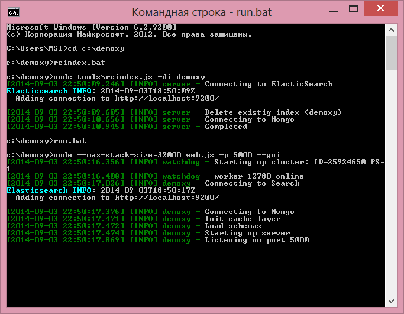

Если последнее сообщение имеет следующий вид:

::

    [<Дата> <Время>] [INFO] demoxy - Listening on port <Порт>

это значит, что процедура запуска Demoxy прошла успешно. **Важно: не
закрывайте данное окно после запуска! Demoxy будет продолжать работать
до тех пор, пока открыто данное окно.**

В случае ошибки выводится, например, следующее сообщение:

.. figure:: _static/ii_18.png
   :alt:

Возможные сообщения об ошибке при запуске Demoxy:

1. ``Error: failed to connect to [localhost:27017]`` - ошибка
   подключения к MongoDB. Проверьте правильность выполнения шага 4.
2. ``Error: Cannot start server with SSL. Please, check if certificates exist.``
   - сертификат и ключ не найдены, проверьте их наличие в каталоге
   ``c:\demoxy\cert``.
3. ``Error: Cannot start server on specified port. Port already in use.``
   - порт, который был указан для запуска Demoxy уже используется. Вам
   следует его освободить или изменить значение параметра ``--port`` в
   ``run_demoxy.bat``.

Ссылки
------

Ссылки на скачивание дистрибутивов:
'''''''''''''''''''''''''''''''''''

  **MongoDB**

  -  `32x разрядная
     Windows <https://fastdl.mongodb.org/win32/mongodb-win32-i386-2.6.1.msi>`__
  -  `64x разрядная
     Windows <https://fastdl.mongodb.org/win32/mongodb-win32-x86_64-2008plus-2.6.1.msi>`__

  **Node.js**

  -  `32x разрядная
     Windows <http://nodejs.org/dist/v0.10.28/node-v0.10.28-x86.msi>`__
  -  `64x разрядная
     Windows <http://nodejs.org/dist/v0.10.28/x64/node-v0.10.28-x64.msi>`__

  **Elasticsearch**

  -  `Windows <https://download.elastic.co/elasticsearch/elasticsearch/elasticsearch-1.5.2.zip>`__

  **Redis**

  -  32x разрядная Windows:

     Скачать утилиту `NuGet <http://nuget.org/nuget.exe>`__

     Выполнить ``nuget.exe install Redis-32``

  -  `64x разрядная
     Windows <https://raw.github.com/mythz/redis-windows/master/downloads/redis64-latest.zip>`__

  **Demoxy**

  -  `demoxy v.1.0.18 <https://s3-eu-west-1.amazonaws.com/tn-releases/dmx/1.0.18-78f738c.zip>`__

.. |image0| image:: _static/ii_3.png
.. |image1| image:: _static/ii_4.png
.. |image2| image:: _static/ii_5.png
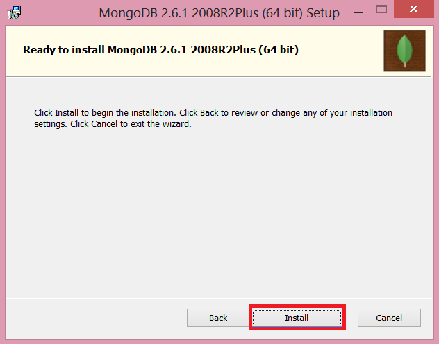
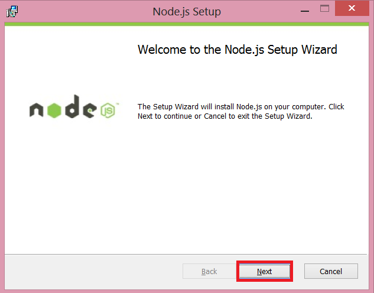
.. |image5| image:: _static/ii_8.png
.. |image6| image:: _static/ii_9.png
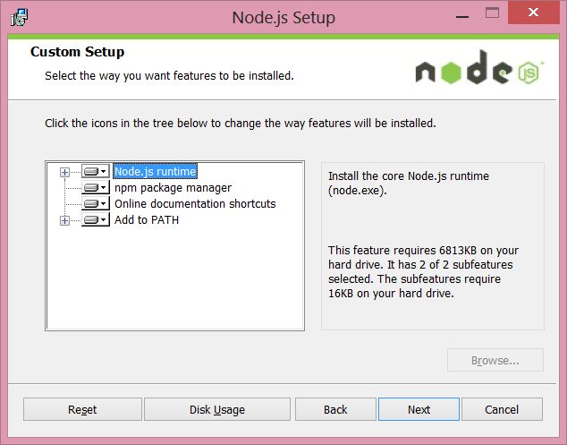
.. |image8| image:: _static/ii_11.png
.. |image9| image:: _static/ii_15.png
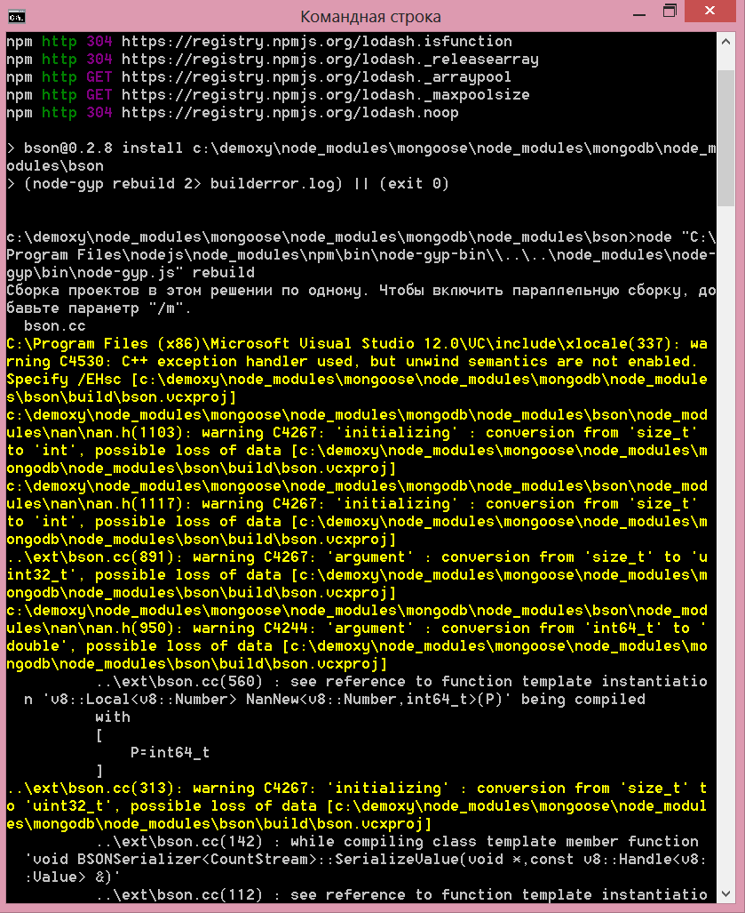
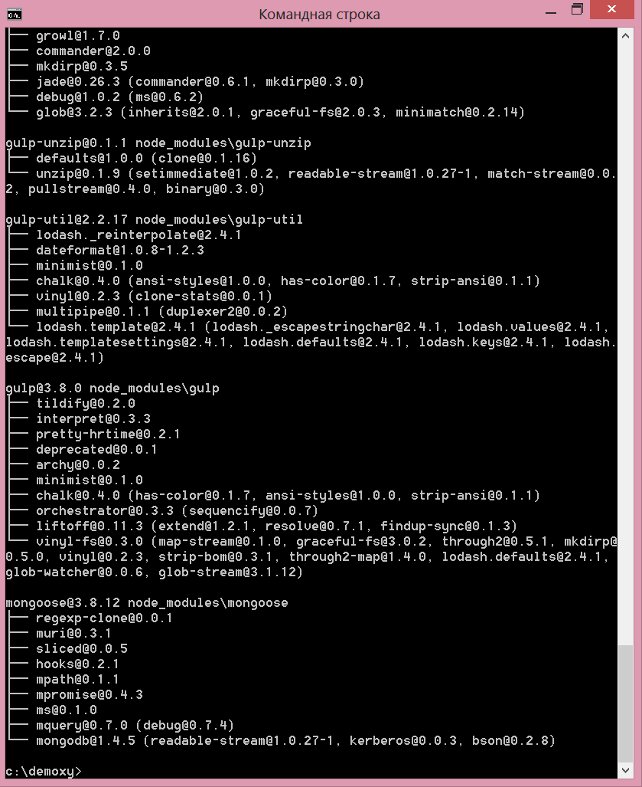
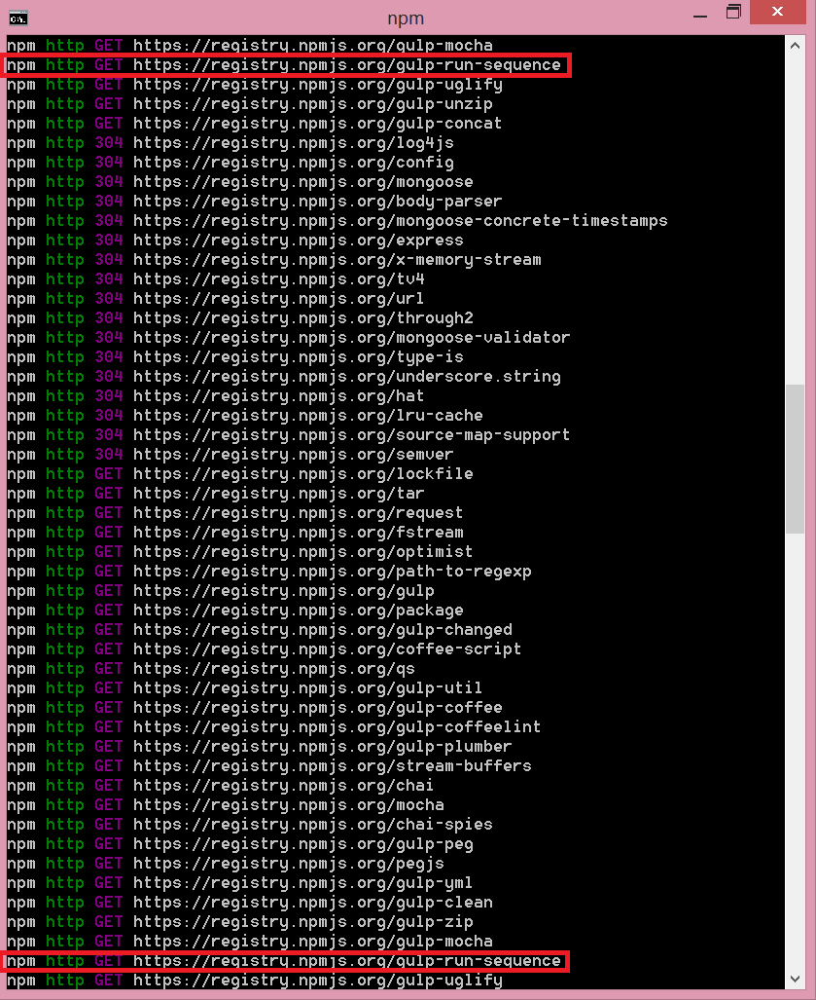
.. |image13| image:: _static/ii_openssl_1.png
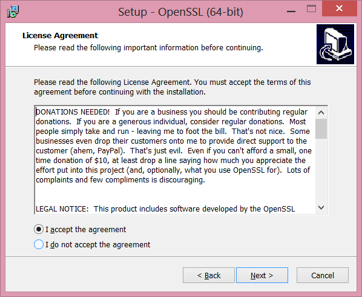
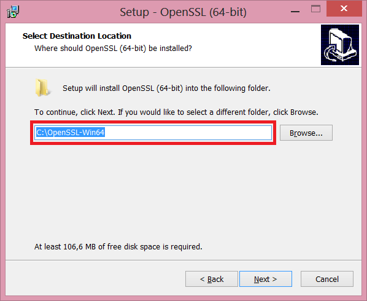
.. |image16| image:: _static/ii_openssl_4.png
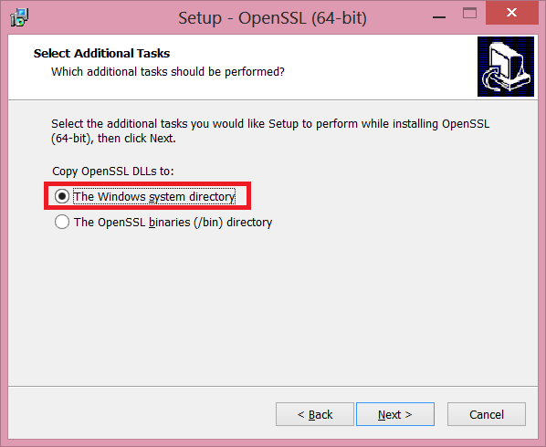
.. |image18| image:: _static/ii_openssl_6.png
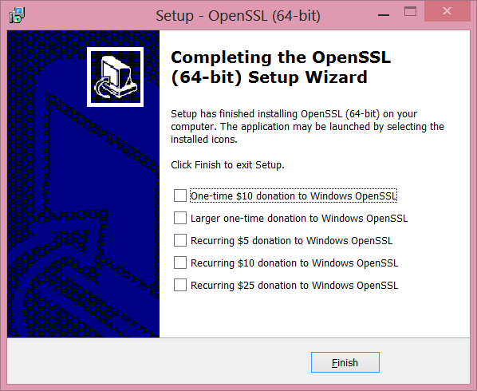
