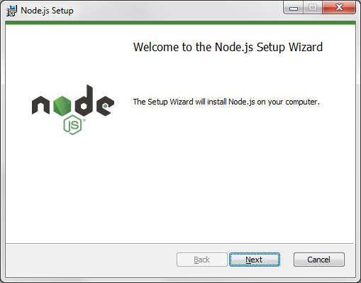
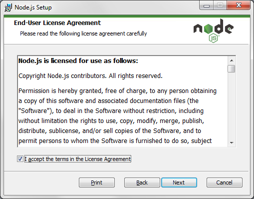
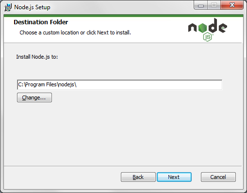
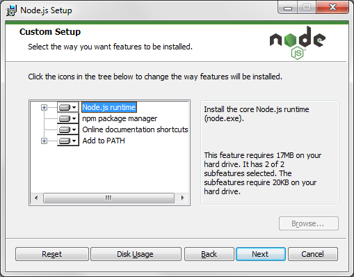
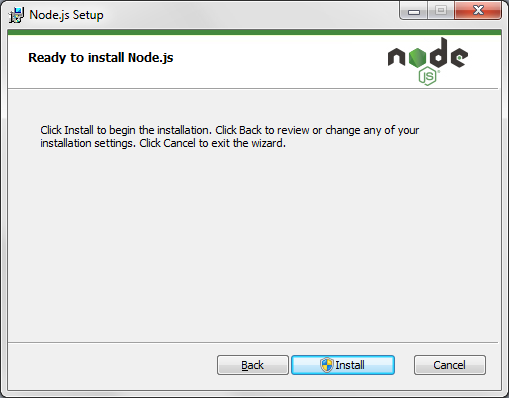
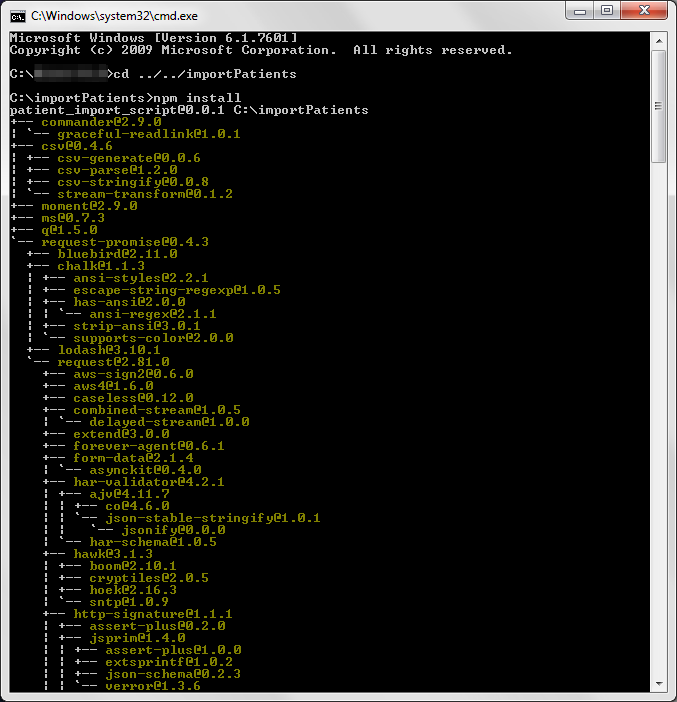
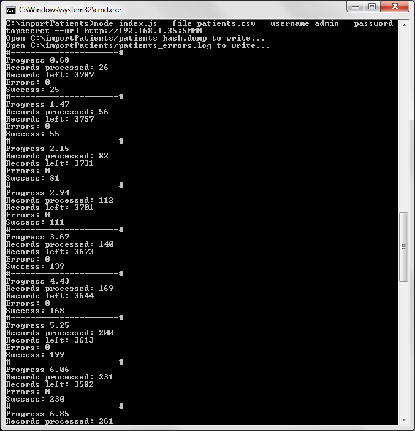

Импорт пациентов
================

Импорт пациентов включает в себя выполнение следующих шагов:

1. Подготовить базу пациентов в определенном формате.
2. Определить разрядность операционной системы, на которой будет запущен скрипт.
3. На основании сведений шага 2, скачать и установить комплект необходимого программного обеспечения.
4. Скачать скрипт импорта пациентов, выполнить его настройку и запуск.

1. Подготовка базы пациентов
----------------------------

Для импорта пациентов в систему необходимо подготовить файл с данными в формате ``.csv`` придерживаясь следующих условий:

1.1. Таблица должна содержать следующие столбцы:

   - Номер карты (MEDESK)	
   - Номер карты (клиника)	
   - Фамилия	
   - Имя	
   - Отчество	
   - Дата рождения	
   - Пол	
   - Почта 1	
   - Почта 2	
   - Телефон 1	
   - Телефон 2	
   - Паспорт (серия)	
   - Паспорт (номер)	
   - Паспорт (кем выдан)	 
   - Паспорт (дата выдачи)	
   - Паспорт (код подразделения)	
   - Свид. о рождении (серия)	
   - Свид. о рождении (номер)
   - Свид. о рождении (кем выдан)
   - Свид. о рождении (дата выдачи)
   - ИНН	 
   - СНИЛС	
   - Номер пенсионного удостоверения	
   - Адрес (индекс)	
   - Адрес (область)	
   - Адрес (населенный пункт)
   - Адрес (улица, дом, кв.)	

1.2. Первое поле следует оставлять пустым, если пациент первый раз добавляется в систему.

1.3. Обязательные поля для заполнения:

   - Фамилия
   - Имя
   - Дата рождения
   - Пол

1.4. В качестве разделителя в таблице должен использоваться ``tab`` (Для MS Excel нужно сохранять файл как текстовый с разделителем-табуляцией)

1.5. **Важно: необходимо чтобы файл имел кодировку UTF-8. Файл можно сохранить в кодировке UTF-8 открыв его в "Блокнот" -> Сохранить как... -> В поле "Кодировка" выбрать UTF-8**

Далее считаем что файл размещен в ``c:\importPatients\patients.csv`` (дальнейшая информация в инструкции будет ссылаться на этот путь).

2. Определение разрядности операционной системы
-----------------------------------------------

Все операционные системы можно разделить на два основных типа: 32х- и
64х-разрядные. Знать разрядность системы крайне важно при выборе и установке
программного обеспечения, так как, например, программы, созданные для
работы в 64х-разрядных операционных системах не могут работать на
32х-разрядных. В связи с тем, что Demoxy для нормальной своей работы
требует установки дополнительного программного обеспечения, первым шагом
необходимо узнать разрядность операционной системы, и использовать ее на
шаге 2. во время выбора программного обеспечения.

Windows

`Методика определения разрядности
Windows <http://support.microsoft.com/kb/827218/ru>`__

Определение разрядности Windows можно доверить непосредственно сервису

.. figure:: _static/ii_1.png
   :alt:

или сделать вручную, следуя инструкциям для вашей версии Windows

.. figure:: _static/ii_2.png
   :alt:

3. Установка комплекта программного обеспечения
-----------------------------------------------

Для запуска скрипта требуется провести установку и настройку
базового комплекта программного обеспечения, в который входят:

-  ``Nodejs``

Установка node.js на Windows
''''''''''''''''''''''''''''

Nodejs — программная платформа, которая является
основой скрипта для и должна быть установлена перед его запуском.
Необходимую версию данного продукта можно скачать с сайта разработчика.

3.1. Скачать дистрибутив node.js, соответствующий разрядности вашей
     операционной системы:

   `Страница загрузки <https://nodejs.org/en/download/>`__

3.2. Далее установить программу с настройками по умолчанию.

   |image0| 
   
   |image1|
   
   |image2|   

   |image3|

   |image4|

4.1 Получение скрипта и предварительная настройка
-------------------------------------------------

4.1.1. Скачать архив со скриптом для импорта базы пациентов `по этой ссылке <https://s3-eu-west-1.amazonaws.com/tn-releases/various/import.zip>`__.

4.1.2. Создать каталог, в котором будет запущен скрипт (мы предполагаем, что используется каталог ``c:\importPatients``)

4.1.3. Распаковать архив в созданный каталог (**Важно: перед следующим шагом необходимо убедится что в папке находится 2 файла:** ``package.json`` **и** ``index.js``)

4.1.4. Запустить командную строку Windows, перейти в каталог со скриптом (``c:\importPatients``), и выполнить команду ``npm install``.

   |image5|

4.2. Запуск скрипта и процесс работы
------------------------------------

4.2.1. Параметры запуска
'''''''''''''''''''''''' 
Перед запуском следует определиться с параметрами запуска: 

-  ``-f [path]`` или ``--file [path]`` - путь к подготовленному ``.csv`` файлу
   с базой пациентов
-  ``-u [username]`` или ``--username [username]`` - логин учетной записи MEDESK, 
   от имени которой в системе будут создаваться пациенты
-  ``-p [password]`` или ``--password [password]`` - пароль учетной записи MEDESK, 
   от имени которой в системе будут создаваться пациенты
-  ``--url [url]`` - сетевой адрес сервера ПДН. Для того чтобы пациенты импортировались
   через локальный сервер ПДН, необходимо указать внутренний сетевой адрес ранее 
   локально установленного сервера ПДН
-  ``--continue`` - если эта опция указана, импорт пациентов будет продолжен с 
   последнего момента остановки скрипта, иначе - пациенты будут созданы заново.

Строка запуска в итоге должна выглядеть следующим образом для первого запуска: 

::

  node index.js --file patients.csv --username user --password pass --url http://192.168.1.10:5000

Для повторного запуска: 

::

  node index.js --file patients.csv --username user --password pass --url http://192.168.1.10:5000 --continue

**Важно: перед запуском необходимо убедиться, что у пользователя системы, от имени которого
запускается скрипт, есть права на запись файлов в каталог** ``c:\importPatients``

**Важно: перед запуском необходимо убедиться, что у пользователя MEDESK, логин и пароль
которого указаны в параметрах, установлена должность по умолчанию "Системный администратор"**

4.2.2. Запуск скрипта
'''''''''''''''''''''

Для запуска скрипта перейдите в каталог ``c:\importPatients``
При первом запуске в каталоге ``c:\importPatients`` будут созданы два файла: 

- ``c:\importPatients\patients_errors.log`` - информация по ошибкам возникшим в процессе работы
  скрипта.
- ``c:\importPatients\patients_hash.dump`` - информация по тому, какие пациенты из базы уже были созданы.

В процессе работы, скрипт каждые 10 секунд будет выводить краткий отчет о прогрессе:

|image6|

В каждом блоке: 

- ``Progress`` - прогресс завершенности импорта в %.
- ``Records processed`` - сколько записей было обработано.
- ``Records left`` - сколько записей осталось обработать.
- ``Errors`` - сколько записей не было обработано из-за ошибки.
- ``Success`` - сколько записей было успешно обработано.

После импорта всей базы скрипт завершится с сообщением ``done``.
Если в последнем блоке прогресса ``Errors`` не нулевой, необходимо
проконсультироваться со специалистом MEDESK по причине того, почему и какие
пациенты не были импортированы, предоставив файл ``patients_errors.log``

